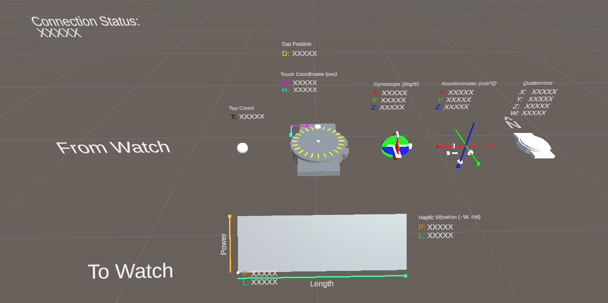

# Getting started

To start using your Port 6 capable smartwatch with a compatible headset, drag and drop the following unity package into your Unity Editor’s assets folder and import everything.

[WatchBridge0.2.0.unitypackage](https://s3-us-west-2.amazonaws.com/secure.notion-static.com/dd23e5cf-551d-4504-8a78-cb17df823297/WatchBridge0.2.0.unitypackage)

## Watch Manager

In the **root directory** of the package, you will find a script **“WatchManager.cs”**. This is the script that provides everything you need to interface with your watch including defining the name of your watch, polling for the latest sensor values, attaching callbacks to the watch sensor outputs, and sending haptic feedback commands to the watch.

Below is an overview of the type of information that passes through Watch Manager and how to use them.

[Data](https://www.notion.so/6fce2e1fd89b44d780e9d7b19e68948a)

Here are some examples on how to poll for the latest watch sensor value and invoke a vibration.

```csharp
// read the latest accelerometer reading
Vector3 latestAccelerometerReading = watchManager.Acceleration;

// vibrate the watch for 100 milliseconds at 80% power.
watchManager.Vibrate(100, 0.8f);
```

### Connecting

Connecting to the watch is initiated in the `Start` method of the Watch Manager. When the connection is established, the `m_ConnectEvent` Unity event is invoked. Furthermore, when the connection is active, the `IsConnected` property is `true`. If no device can be connected to within a reasonable time, the `m_TimeoutEvent` is invoked.

To define the watch to connect to, set the `watchName` property (visible in the Editor as the Watch Name field) of the Watch Manager to the Bluetooth name of the watch, or any substring thereof. Alternatively, the property can be left empty, in which case the connection is established with any compatible watch within range.

When the connection is severed either by the watch or the application, the `m_DisconnectEvent` Unity event is invoked.

## Watch Visualizer Prefab

The folder **“WatchVisualizerExample”** contains the **WatchVisualizers** prefab. This prefab contains prebuilt visualization objects for each of the data inputs and outputs as well as the general state of the watch and the Bluetooth connection established with it.



This should help to make sure that the Watch Manager is working as expected, to monitor latency levels, and to give an example for how Watch Manager is used.

## Building and Launching

### Quest 2

In order for Bluetooth to function on the Oculus Quest 2, permissions for Bluetooth and location must be included in an Android manifest file within the project.

```xml
<manifest
  # ...

  # Add the following four lines to an AndroidManifest.xml file within the project:
  <uses-permission android:name="android.permission.ACCESS_FINE_LOCATION" />
  <uses-permission android:name="android.permission.BLUETOOTH_ADMIN"/>
  <uses-permission android:name="android.permission.BLUETOOTH"/>
  <uses-feature android:name="android.hardware.bluetooth_le" android:required="false"/>

</manifest>
```

### HoloLens 2

Mixed Reality Toolkit will not automatically detect or add Bluetooth permissions or capabilities to your project. Instead, you need to add Bluetooth capabilities manually through both the project settings in Unity as well as through Visual Studio where you build and launch the app.

In Unity: Go to *Edit → Player Settings → Player → Windows Icon Tab → Publishing Settings → Capabilities* ****and **check the Bluetooth** box.

In Visual Studio, after opening the solution file built by Unity: in the *Solution Explorer* panel, find and open `Package.appxmanifest`, click on the *Capabilities* tab and **check the Bluetooth** box.

## Usage

As of version 0.2.0, no conventional Bluetooth pairing is needed.

To use the watch bridge, make sure the Port 6 XR Controller app on your smartwatch is open, in the foreground, and displays “Waiting for a connection...”. When you then open your own app on the headset, the app will start scanning for the watch with the name given to the Watch Manager it in the inspector and request to connect to the watch.

At this point, the watch should display a prompt to the user asking whether to accept the connection request. Select yes, and the watch will connect with the headset. If the same headset tries to connect to the watch again after being approved during the lifetime of the watch app, the connection request is automatically approved.

The watch is successfully connected to a headset when the Port 6 logo is visible on the watch face. It is now streaming data to the headset and listening for haptic vibration commands.

## Supported Platforms

WatchBridge 0.2.0 has been tested with the following platform versions but might work with earlier versions.

- Oculus Quest 2 (recommended), runtime version 37.0.0.147...
- HoloLens 2 (very low sample rates only... for now), version ???
- Unity, version 2020.3.27f1
- Oculus Integration for Unity, version 37.0
- HoloLens Mixed Reality Toolkit for Unity, version ???
- Samsung Galaxy Watch 4 Classic, Wear OS version 3.2

## Dependencies

None 🎉

## Known Issues

- The Quaternion Visualizer is not properly defined yet so it’s inaccurate. Working on it!
- The HoloLens can exhibit extreme latencies in receiving smartwatch sensor data. This is still being investigated.
- On Oculus, when the app compiles and launches asking for location permission for the first time, and as a user you accept the permissions, it’s possible that the app doesn’t register the granted permission until you restart the Oculus app.
- Unity Editor warnings coming from BluetoothLEUWP.cs are harmless.
- Scanning for a watch consumes a lot energy, so the duration for which the headset is asked to scan last for an arbitrary number of seconds (around 20 seconds as of now). If a Port 6 capable watch has not been found within that time, restart the app to restart scanning.e


