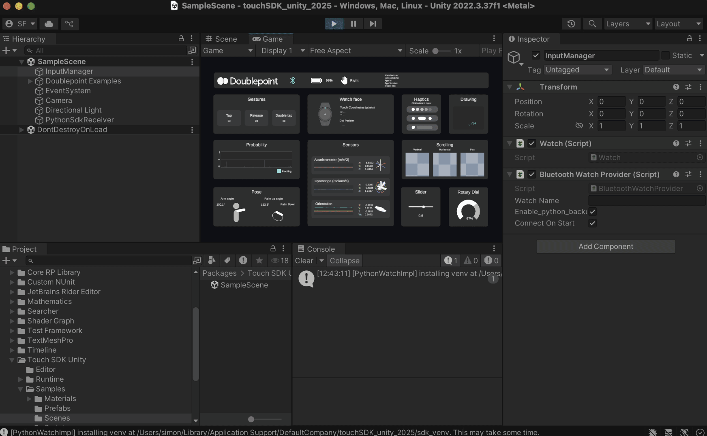

# Touch SDK Unity


[](https://chat.doublepoint.com)

C# scripts for bridging Unity applications with Doublepoint enabled smart peripherals.



## Installation

### On disk

Using the Package Manager window inside unity, select "Add package from disk" and select the `package.json` file in the root of this repository.

## Example usage

1. Create an empty gameObject
2. Add the `Watch` script to gameObject (`Runtime/Watch.cs`)
3. Add the `BluetoothWatchProvider` script to gameObject (`Runtime/BluetoothWatchProvider.cs`) 
4. Create new script and add following code:

```csharp

using UnityEngine;
using Psix.Interaction;

public class WatchExample : MonoBehaviour
{
    public void Start()
    {
        Watch.Instance.OnGesture += OnGesture;
        Watch.Instance.OnAcceleration += OnAcceleration;
        Watch.Instance.OnAngularVelocity += OnAngularVelocity;
        Watch.Instance.OnGravity += OnGravity;
        Watch.Instance.OnOrientation += OnOrientation;
    }

    public void OnGesture(Gesture gesture){
    }

    public void OnAcceleration(Vector3 acceleration){
    }

    public void OnAngularVelocity(Vector3 gyro){
    }

    public void OnGravity(Vector3 gravity){
    }

    public void OnOrientation(Quaternion currentQuaternion){
    }

}

```


Copyright (c) 2025 Doublepoint Oy <hello@doublepoint.com>
Licensed under the MIT License. See LICENSE for details.
